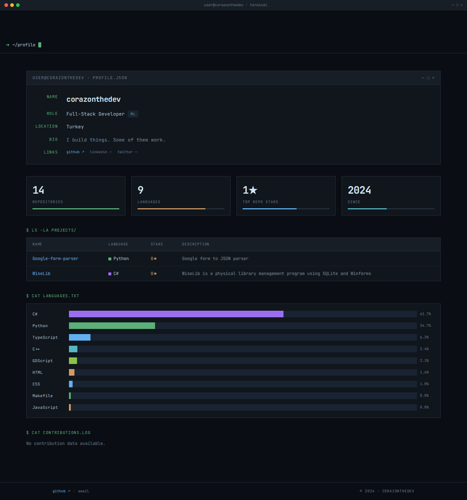

# ⌨️ Developer Portfolio

> Terminal-themed developer portfolio. Fetches pinned repos, language stats, and contribution graphs from the GitHub API at build time. Built with Next.js 16, Tailwind CSS 3, and TypeScript.

<p align="center">
  
</p>

<p align="center">
  <a href="https://github.com/corazonthedev/dev-portfolio"></a>
  <a href="https://github.com/corazonthedev/dev-portfolio/actions"></a>
  <a href="https://nextjs.org/"></a>
  <a href="https://www.typescriptlang.org/"></a>
  <a href="https://tailwindcss.com/"></a>
  <br/>
  <a href="https://corazonthedev.vercel.app">🌐 Live Demo</a>
  ·
  <a href="#-fork-your-own">📦 Fork</a>
  ·
  <a href="https://github.com/corazonthedev/dev-portfolio/issues">🐛 Report Bug</a>
</p>

---

## Features

- **Terminal UI** — macOS-style chrome bar (●●● window controls), status prompt (`➜ ~/profile`), blinking cursor
- **Live GitHub data** — repos, languages, stars, contribution heatmap fetched at build time
- **Metric cards** — repo count, language count, top stars, activity since — with color-coded progress bars
- **Projects table** — `$ ls -la projects/` — terminal-style table with colored language dots
- **Language chart** — `$ cat languages.txt` — horizontal bars with real byte-count percentages
- **Contribution graph** — SVG heatmap grid (GitHub-style, requires `GITHUB_TOKEN`)
- **Fully responsive** — 4-column metrics on desktop, 2 on mobile
- **Accessible** — semantic HTML, `aria-hidden` on decorative elements, `scope="col"` on table headers
- **Single config** — edit `src/config.ts` → your own portfolio. That's it.

---

## Quick Start

```bash
git clone https://github.com/corazonthedev/dev-portfolio.git
cd dev-portfolio
npm install
echo "GITHUB_TOKEN=*** > .env.local
npm run dev
```

Open [http://localhost:3000](http://localhost:3000).

---

## Design

Designed by [Open Design](https://open-design.ai/). Terminal/tech-dashboard aesthetic inspired by macOS terminal, JetBrains IDEs, and developer tooling.

### Color Palette

| Token | Value | Usage |
|-------|-------|-------|
| `#0a0e14` | bg-primary | Page background |
| `#10161c` | bg-surface | Cards, tables, panels |
| `#181e26` | bg-header | Terminal chrome, header bar |
| `#252e3a` | border | All borders |
| `#5caf78` | accent-green | Primary accent, Python |
| `#61afef` | accent-blue | Links, TypeScript |
| `#d19a66` | accent-orange | Stars |
| `#56b6c2` | accent-cyan | C++ |
| `#9b6ef0` | accent-purple | C# |
| `#8bc34a` | accent-lime | GDScript |
| `#d4e6f5` | text-primary | Headings |
| `#b3c4d4` | text-body | Body text |
| `#6a7a8a` | text-muted | Secondary labels |

### Typography

- **Font:** `'JetBrains Mono', 'IBM Plex Mono', ui-monospace, Menlo, monospace`
- **Scale:** 10px (labels) · 11px (prompts) · 12px (table) · 13px (body) · 20px (name) · 28px (metrics)
- **Style:** Full monospace — no sans-serif fallback

### Layout

- **Max width:** 1200px container, centered
- **Terminal chrome:** Fixed 28px top bar with window controls
- **Status bar:** `➜ ~/profile` prompt with CSS-animated blinking cursor
- **Cards:** `#10161c` surface, `1px solid #252e3a` border, zero border-radius
- **Spacing:** `mb-8` between sections, `container` provides `48px 32px 64px` padding

---

## Screenshots

| Section | Preview |
|---------|---------|
| **Terminal Chrome + Profile** | `user@corazonthedev · profile.json` — name, role (with ML tag), location, bio, social links |
| **Metric Cards** | 4-column grid: repositories (13), languages (8), top stars (1★), since (2024) |
| **Projects Table** | `$ ls -la projects/` — pinned repos with language dots and star counts |
| **Language Chart** | `$ cat languages.txt` — horizontal bars with percentages |
| **Contribution Graph** | `$ cat contributions.log` — GitHub-style SVG heatmap |

> Generate fresh screenshots: `npx playwright screenshot --full-page http://localhost:3000 public/screenshot.png`

---

## Project Structure

```
src/
├── app/
│   ├── layout.tsx           # Root layout + metadata + SEO + viewport
│   ├── page.tsx             # Home page composition (server component)
│   ├── not-found.tsx        # 404 — "$ cat /dev/404"
│   ├── error.tsx            # Error boundary — "$ stderr.log"
│   ├── loading.tsx          # Loading state — blinking cursor
│   ├── global-error.tsx     # Fatal error boundary
│   ├── globals.css          # All styles + CSS custom properties
│   └── api/github/route.ts  # GitHub API proxy handler
├── components/
│   ├── layout/
│   │   ├── Header.tsx       # Terminal chrome bar + status prompt
│   │   └── Footer.tsx       # Link row + copyright
│   └── sections/
│       ├── Hero.tsx         # Profile card (terminal-card)
│       ├── Metrics.tsx      # 4-column metric grid
│       ├── PinnedProjects.tsx # Projects table
│       ├── Languages.tsx    # Language section wrapper
│       ├── LanguageChart.tsx # Horizontal bar chart
│       ├── Contributions.tsx # Contribution section wrapper
│       └── ContributionGraph.tsx # SVG heatmap grid
├── lib/
│   ├── github.ts            # GitHub REST + GraphQL client
│   ├── fetch-portfolio-data.ts # Build-time data fetcher
│   └── lang-colors.ts       # Language → color mapping
├── types/
│   └── github.ts            # GHRepo, GHContributionDay, PortfolioData
├── config.ts                # Single configuration file
└── test/
    ├── github.test.ts       # API client tests
    ├── fetch-portfolio-data.test.ts # Data aggregator tests
    └── setup.ts             # Vitest configuration
```

---

## Configuration

All personalization lives in a single file:

```ts
// src/config.ts
export const siteConfig = {
  github: {
    username: "your-username",
    pinnedRepos: ["Repo1", "Repo2"],
  },
  personal: {
    name: "Your Name",
    title: "Full-Stack Developer",
    bio: "Short bio",
    location: "City, Country",
    email: "",
  },
  social: {
    github: "https://github.com/your-username",
    linkedin: "https://linkedin.com/in/...",
    twitter: "https://x.com/...",
  },
  signature: "your-username",
  since: 2024,
};
```

Edit, commit, deploy. Done.

---

## API Reference

### GitHub Client (`src/lib/github.ts`)

| Function | Returns | Description |
|----------|---------|-------------|
| `fetchUserRepos(username?)` | `GHRepo[]` | All public repos sorted by update date |
| `fetchRepoLanguages(username, repo)` | `Record<string, number>` | Byte count per language |
| `fetchContributions(username?)` | `GHContributionWeek[]` | Contribution calendar via GraphQL |

All functions authenticate with `GITHUB_TOKEN` when available. Without a token, the contributions API returns an empty array and REST calls have a 60 req/hour rate limit.

### Data Fetcher (`src/lib/fetch-portfolio-data.ts`)

```typescript
interface PortfolioData {
  repos: GHRepo[];
  totalLanguages: Record<string, number>;
  contributions: GHContributionWeek[];
}
```

Called at build time from the homepage server component:

```typescript
export default async function Home() {
  const data = await getPortfolioData();
  // ...
}
```

### Route Handler (`src/app/api/github/route.ts`)

- `GET /api/github` — health check
- `GET /api/github?path=users/:username` — proxy to GitHub API with auth
- Not used in static export mode (`output: "export"`)

---

## Tech Stack

| Technology | Version | Purpose |
|-----------|---------|---------|
| Next.js | 16.3 (canary) | App Router, React Server Components, ISR |
| React | 19 | UI framework |
| TypeScript | 5 | Type safety |
| Tailwind CSS | 3 | Utility-first CSS |
| Vitest | 4 | Unit testing |
| GitHub REST API | v3 | Repository data |
| GitHub GraphQL API | v4 | Contribution calendar |
| JetBrains Mono | — | Monospace font (Google Fonts) |

---

## Development

```bash
# Start dev server
npm run dev

# Type check
npx tsc --noEmit

# Run tests
npx vitest run

# Production build
VERCEL=1 npm run build
```

> **Note:** Global `NODE_ENV=production` causes npm to skip devDependencies. Use `VERCEL=1` to work around a Next.js 16 `_global-error` prerender bug.

---

## Deployment

### Vercel (recommended)

```bash
npm i -g vercel
vercel --prod
```

Set environment variable `GITHUB_TOKEN` in Vercel dashboard (Settings → Environment Variables).

### Manual

```bash
VERCEL=1 npm run build
# Deploy the .next/ directory to any Node.js hosting
```

---

## Testing

```bash
npx vitest run
```

**10 tests across 2 suites:**

- **GitHub API client** (7 tests) — mocked fetch, error handling, rate limits, missing token fallback, GraphQL parsing
- **Portfolio data** (3 tests) — language aggregation, error resilience, empty repo list

Tests use `vitest` with `vi.mock()` for config and `vi.resetModules()` for fresh module imports.

---

## Version History

- **1.0.0** — Initial release. Terminal-themed portfolio with GitHub API integration.

---

## License

MIT © [corazonthedev](https://github.com/corazonthedev)

---

<p align="center">
  <sub>Built with</sub>
  <br/>
  <code>➜ ~/portfolio $</code>
  <span style="display:inline-block;width:8px;height:14px;background:#5caf78;animation:blink 1s step-end infinite;vertical-align:middle;margin-left:4px"></span>
</p>
